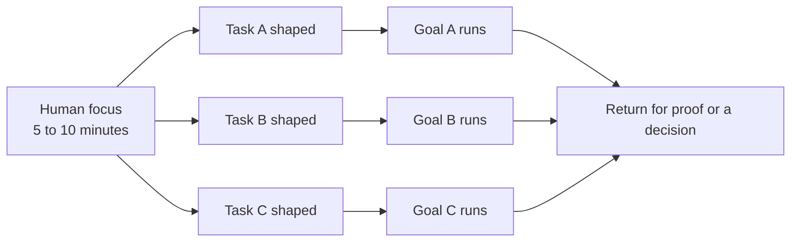
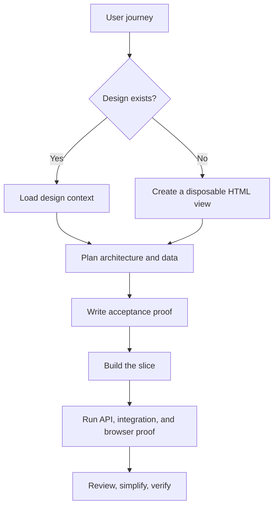
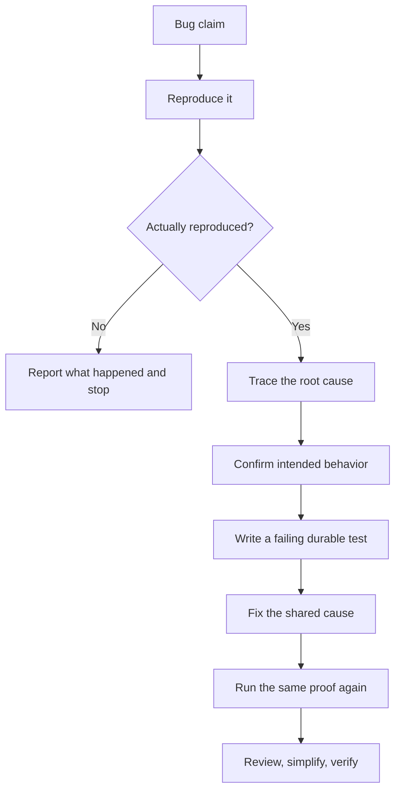
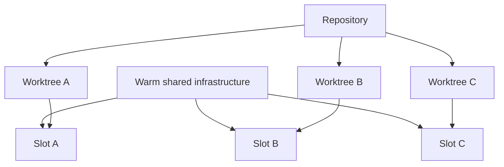
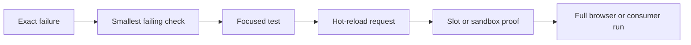
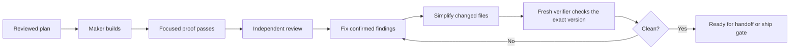
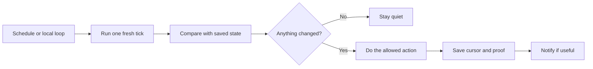

# The Terminal-First Coding Operating System

I work on several software projects at the same time, but I do not code them in round-robin.

The round-robin part is only the setup.

I spend five to ten focused minutes on one task. I load the right context, tighten the goal, define how we will prove it worked, and decide what still needs a human. Then the agent keeps running for a long time without me. I move to the next task and do the same thing again.

That is the operating system in this repository.

It is built around a few simple ideas:

- keep the cockpit in the terminal
- isolate every mutating task
- make proof cheaper than babysitting
- separate the maker from the reviewer
- let loops watch the boring parts
- send milestone updates only when something real changed

This repo has two jobs:

- explain the method in plain language
- ship a public-safe `skills/` pack that makes the method reusable

## The Core Idea

The useful round-robin loop is:

```text
shape task -> define proof -> launch goal -> move on -> return only for proof or a decision
```

It is not:

```text
write half a fix -> switch -> write half a feature -> switch -> forget what each pane was doing
```




The point is not fewer tasks. The point is fewer half-formed tasks.

## Why cmux

I use [cmux](https://cmux.com/) because it gives me one visible cockpit for many long-running coding sessions.

A workspace maps to a project. A tab maps to a task. Panes map to roles inside that task.


On a large screen, my default four-pane layout is:

| Pane | Usual job | Why |
| --- | --- | --- |
| bottom left | current human focus | closest to my eye, this is where I shape work |
| top left | long-running goal | I can see the maker continue without taking over the main pane |
| bottom right | proof and review | tests, CI, screenshots, or reviewer output |
| top right | context and visuals | design, docs, tickets, logs, or another reference |

That layout is a default, not a rule. The important part is that each pane has a job.

The other half of cmux is notifications.


The session should not make me stare at it. It should tell me when it finished, failed, or needs a decision. In my setup, those milestones can also go out through OpenClaw to WhatsApp, so the task can keep moving while I am away from the main screen.

The problem cmux solves is not "I need more terminals." The problem is:

- I have many long-running sessions
- I need to know which one needs me now
- I need to return to the right place fast
- I do not want context to leave the terminal

## The Work Lanes

Feature work and bug fixes matter, but they are not the whole system. After looking across my sessions and skills, these are the main lanes:

| Lane | First question |
| --- | --- |
| discovery and design | what should the experience be? |
| feature delivery | what new outcome are we adding? |
| bug reproduction and fixing | can we prove the broken behavior first? |
| review and polish | is this exact change safe, simple, and clean? |
| operations and release | is the tested version the version that is actually running? |
| integrations and automation | can this repeated handoff become a CLI, MCP tool, or script? |
| knowledge and communication | should this become a ticket, document, handoff, or memory? |
| maintenance and simplification | what can we remove, tighten, or warm up to save future time? |

These lanes change the proof.

A browser-facing feature needs browser proof. A backend fix needs a durable test. A release needs source, CI, artifact, runtime, and consumer proof tied to the same candidate. A ticket-writing task does not need any of that.

## Feature Work

For a feature, I start from the user journey, not from the first file I want to edit.

If design exists, I pull it in. If it does not, I may ask for a disposable HTML artifact so we can see the shape before we build it. Then I think through the data, failure states, permissions, empty states, and acceptance criteria. Once the plan is tight, the agent can do a large chunk of the implementation on its own.



The inner loop should be cheap:

- write the smallest proof that can fail
- build the smallest coherent slice
- use hot reload when possible
- do the expensive browser or end-to-end run near the end

## Bug Work

For a bug, the first job is not fixing. The first job is proving the bug exists.

That matters for two reasons:

- some bug reports are misunderstandings
- some real bugs have several possible fixes, and the product tradeoff still needs a human



This is why bug reproduction deserves its own skill. It is a real phase, not just the first sentence of the fix.

## Worktrees and Warm Infrastructure

Many agents can run at the same time. Many agents should not write into the same checkout at the same time.

Every mutating task gets its own worktree.



Worktrees solve file isolation.

Slots solve runtime isolation.

Warm infrastructure solves the hidden tax of AI development. In the public pack, `worktree`, `dev-flow`, and `hot-reload` are the three skills that make this practical. If every tiny fix forces a full Docker boot, rebuild, or environment restart, most of the "work" becomes waiting. Shared services should stay warm. The active task should get the fastest feedback loop the repo can honestly support.

## Use the Cheapest Useful Test

The most expensive proof should not be the default development loop.



If a higher level fails, I go back down to the cheapest level that reproduces the failure. I do not keep paying for a full rebuild or browser journey just to discover the next small error.

This is one of the biggest practical differences between a pleasant AI workflow and an expensive one.

## The Maker Should Not Grade Its Own Work

I often let one model build and another model challenge the result.

The exact products can change. The role separation is the important part.



The public repo calls this lane `review-and-polish`.

Inside the real workflow, that usually means some combination of:

- a code review pass
- a simplifier pass
- a verifier pass
- a final proof pass against the exact candidate

This is also where [Ponytail](https://github.com/DietrichGebert/ponytail) helps. It pushes the maker to delete, reuse, or choose the standard path before complexity spreads.

## Context Should Stay in the Terminal

I try to pull context into the task instead of opening five different UIs and manually translating between them.


The order is simple:

- use a CLI when the tool has a good one
- use MCP when the action is cleaner through a structured connector
- use an API or small wrapper when repeated browser work can become deterministic
- use the browser when the thing being proved is the user experience

That is why CLI matters so much in this setup. It removes friction for the agent.

This is also where Wispr Flow, Gmail, and meeting transcripts fit:

- Wispr Flow lets me speak the rough version quickly
- Gmail can provide narrow context when email matters
- Fireflies or another transcript source can provide decisions and action items from calls

But raw context is not the goal. The goal is a small, sourced context pack that helps the task move.

## Loops and Babysitters

Some work should keep checking while I do something else:

- a PR babysitter
- CI and deployment watching
- a dependency wait
- a bug investigation tick
- a knowledge capture loop
- a runtime watcher

The pattern is always the same: one fresh tick, one saved cursor, one allowed action, one stop rule.



When the loop is local, the laptop stays awake and the agent session stays alive. That local path matters because it can reuse local files, worktrees, CLIs, and signed-in sessions. A cloud-scheduled routine does not automatically get those powers.

The notification style matters too.

I do not want "still working." I want proof-bearing milestones.


An update should look like this:

```text
65% complete
Done: integration tests pass
Proof: 18/18
Next: browser journey
Blocked: none
```

That message is useful because it says what passed, what remains, and whether I am needed.

## What Is in This Repo

- [docs/tooling.md](docs/tooling.md) explains the CLI, MCP, API, browser, and scheduler ladder
- [docs/loops.md](docs/loops.md) explains babysitters, recurring checks, and proof-based notifications
- [docs/architecture.md](docs/architecture.md) shows the public-core versus private-adapter model
- [docs/ecosystem.md](docs/ecosystem.md) lists custom, community, and native capabilities
- [docs/skills.md](docs/skills.md) maps the public skill pack
- [docs/publishing-policy.md](docs/publishing-policy.md) sets the safety boundary for public sharing
- [skills/](skills/) contains the public-safe workflow skills

## The Skills Pack

The `skills/` directory is the executable part of this repo.

It includes:

- `start-work`
- `prepare-context`
- `shape-goal`
- `deliver-feature`
- `reproduce-bug`
- `investigate-bug`
- `fix-bug`
- `worktree`
- `dev-flow`
- `hot-reload`
- `browser-proof`
- `review-and-polish`
- `babysit-pr`
- `access-check`
- `watch-loop`
- `progress-update`
- `release-proof`
- `cleanup`

These are not project adapters. They are reusable operating rules.

The public skill says what the workflow is. A private adapter supplies the real repo names, ticket systems, cloud accounts, ports, credentials, and transport routes.

See [skills/README.md](skills/README.md) for the catalog.

## Install

Install the full public pack with the open agent skills CLI:

```bash
npx skills add sabirmgd/terminal-first-goal-loop --skill '*'
```

Or inspect the catalog first and install only the skills you want:

```bash
npx skills add sabirmgd/terminal-first-goal-loop --list
```

## Why This Exists

The main thing I wanted to capture is not "how to prompt better."

It is how to make AI coding sessions behave like a reliable operating system:

- focused human shaping
- long-running goals
- isolated work
- warm infrastructure
- proof before optimism
- review separated from implementation
- notifications tied to milestones
- context that stays close to the task

That is what makes several projects feel manageable instead of chaotic.
