# How I Run Several AI Coding Projects Without Coding Round-Robin

My screen often has several projects open, each with its own tabs, terminals, agents, tests, and pull requests. That sounds like context-switching hell.

It would be, if I tried to code in every pane.

I don't. I move round-robin only long enough to shape the next piece of work. I give a task five or ten focused minutes. I explain the outcome, load the right context, make the important decisions, and define how we will prove it works. Once the goal is tight, an agent can run for a long time without me. I move to the next task and repeat.

Human attention moves. Agent work continues.

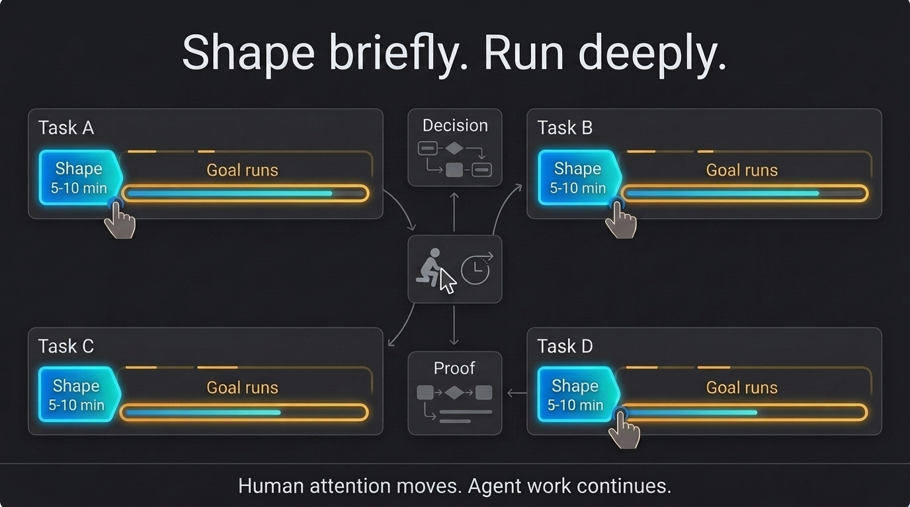

This article explains the system behind that approach: why I use cmux, how I turn rough ideas into long-running goals, how I isolate parallel work, why I keep Docker infrastructure warm, how I review the result with a second model, and how loops bring me back only when something needs attention.

## Shape briefly, then let the goal run

The round-robin part is not implementation. It is preparation.

For each task, I try to answer five questions:

```text
What should change for the user?
What context does the agent need?
How will we prove it works?
Which decisions still need me?
When must the agent stop?
```

That is the smallest useful version of what I call goal engineering. A simple task may need one paragraph. A large feature may need a reviewed plan, acceptance criteria, a test matrix, and clear checkpoints.

Once those answers are solid, I launch the goal. The agent may work for two or three hours. Many agents can run at the same time. What I avoid is personally bouncing between half-written implementations with no plan.

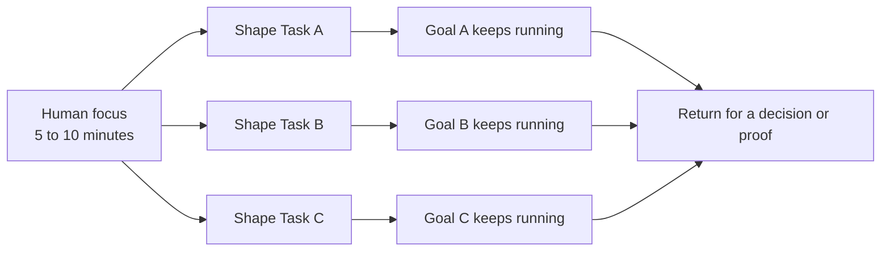

The task is also not the same as a ticket or a pull request. I may group several tickets when they share one user journey and one verification path. One ticket may need several pull requests when repositories, release order, or ownership boundaries differ.

## Why I chose cmux

I did not choose [cmux](https://cmux.com/) because I wanted more terminals. I chose it because I needed a visible operating layer for many long-running sessions.

A workspace maps to a project. A tab maps to a task. Split panes let me keep the work, context, and proof visible together. The sidebar shows where I am, and the notification system tells me where I need to return.

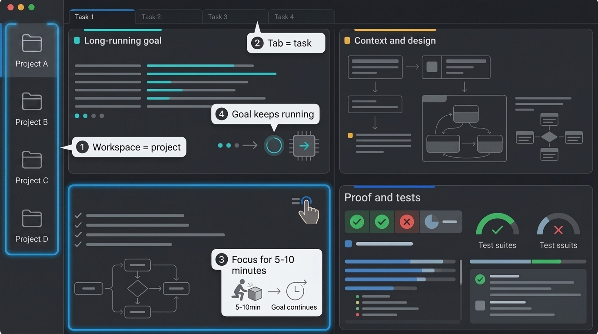

On a large screen, I often use four panes:

- The bottom-left pane gets my direct attention.
- The top-left pane holds the long-running goal.
- The bottom-right pane shows tests, review, CI, or browser proof.
- The top-right pane holds designs, tickets, documentation, or another visual reference.

This is a default, not a law. Some tasks need one pane. Some need two. The point is that each pane has a job, so I do not spend time working out what every terminal is doing.

cmux notifications are the other half of the system. A long-running agent should not need me to stare at it. It should notify me when it has finished, failed, or reached a decision.

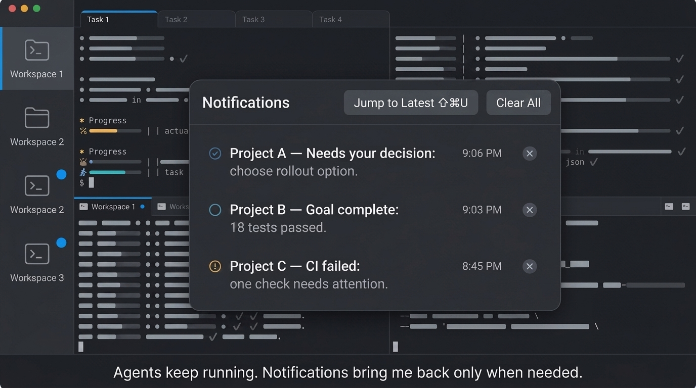

The notifications turn several terminals into a queue I can understand. I can jump to the session that changed instead of scanning every screen. cmux also restores the layout and scrollback, which makes it easier to return after closing the app or restarting the machine. I still save the goal and proof to files because a terminal session is not a durable project record.

## Not every task is a feature or a bug

After looking across the workflows I use, I found eight useful categories:

| Lane | The first question |
| --- | --- |
| Discovery and design | What should the experience be? |
| Feature delivery | What new outcome are we adding? |
| Bug fixing | Can we reproduce the broken behavior? |
| Refactoring and simplification | What can we remove without changing behavior? |
| Review and verification | Does this exact change hold up? |
| Operations and release | Is the tested version safely running? |
| Integrations and automation | Can this repeated handoff become a reliable tool? |
| Knowledge and communication | What needs to become a durable decision, ticket, or document? |

UI, backend, data, security, and infrastructure are usually labels on one of these lanes. Investigation is a phase, not a separate destination.

The lane matters because it changes the proof. A document does not need a deployment test. A production migration needs much more than a unit test.

## Feature work and bug fixes need different loops

For a feature, I start from the user's journey. If Figma exists, I connect it. If it does not, I may use Claude Design or ask the model for a disposable HTML page so I can see the idea before we build it. I think through the architecture, database, empty states, permissions, and failure paths. Then I tighten the plan and let a second model review it if the change is complex.

For a bug, the first job is not fixing. It is proving the bug exists. The agent reproduces the report, traces the real cause, and explains the options. That is the decision gate. Sometimes QA found a misunderstanding, and sometimes there are several valid fixes with different product consequences.

```mermaid
flowchart TB
    subgraph Feature[Feature lane]
        F1["User journey"] --> F2["Design and architecture"]
        F2 --> F3["Acceptance criteria and tests"]
        F3 --> F4["Build"]
        F4 --> F5["Browser or API proof"]
    end

    subgraph Bug[Bug-fix lane]
        B1["Reproduce"] --> B2["Find root cause"]
        B2 --> B3["Confirm the intended behavior"]
        B3 --> B4["Write a failing test"]
        B4 --> B5["Fix once at the shared boundary"]
        B5 --> B6["Run the same test on shipped code"]
    end
```

Tests should outlive the task. For backend work, that normally means real integration or API tests inside the repository's testing framework, not only one-off commands. For user-facing work, the agent uses [agent-browser](https://github.com/vercel-labs/agent-browser) to perform the journey and save screenshots.

## Worktrees make parallel agents safe

Many agents can run at once. They should not all edit the same checkout.

Each mutating task gets its own git worktree. That gives the task its own branch, folder, diff, and runtime slot. Agents can move independently without overwriting each other's files or constantly switching the main checkout.

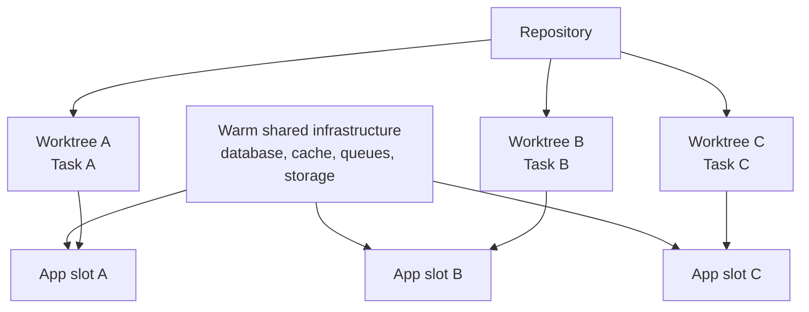

Worktrees solve file isolation. Slots solve runtime isolation.

## Keep Docker warm and use hot reload

I added slots after watching agents waste time rebuilding the same environment. A small fix could trigger a full Docker rebuild, a full startup, and a full end-to-end run. If that cycle takes ten minutes, the agent spends most of its time waiting and rediscovers one error per deployment.

The better setup keeps heavy shared services running once. Each worktree gets a lightweight application slot with predictable ports. The task I am actively shaping can use native hot reload. Background tasks can use isolated containers against the same warm infrastructure.

The same idea applies to testing. Start with the cheapest check that can prove the current claim.

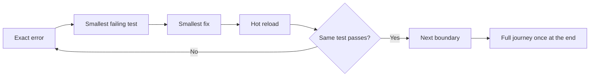

The ladder usually moves from static checks, to a unit test, to a component or integration test, to a local API request, to a slot or sandbox, and finally to the real browser journey. If a higher level fails, I return to the cheapest level that can reproduce that failure. I do not rerun every expensive test after every small edit.

## The maker should not grade its own work

I often use Codex to build and Claude Code to challenge the result. The exact products can change. The separation is what matters.

My normal quality loop looks like this:

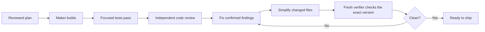

In Claude Code, the [PR Review Toolkit](https://github.com/anthropics/claude-plugins-official/blob/main/plugins/pr-review-toolkit/README.md) provides focused reviewers for code, tests, types, comments, and silent failures. The [code-simplifier](https://github.com/anthropics/claude-plugins-official/blob/main/plugins/code-simplifier/agents/code-simplifier.md) removes unnecessary complexity without changing behavior.

I use [Ponytail](https://github.com/DietrichGebert/ponytail) earlier, while the code is being written. Its job is to ask whether the code needs to exist, whether the codebase already solves the problem, and whether the standard library or an installed dependency is enough. It is much cheaper to avoid unnecessary code than to simplify it later.

For visual work, [Taste](https://github.com/leonxlnx/taste-skill) and [Impeccable](https://github.com/pbakaus/impeccable) push the agent away from generic frontends. They still do not replace accessibility checks, browser testing, or product judgment.

## Skills are the reusable part

A good agent session can disappear. A good skill keeps the lesson.

Across different codebases, my skill names vary, but the patterns repeat: shape a goal, check access, reproduce a bug, create a worktree, start an environment, test through the browser, review a diff, simplify the code, watch a deployment, send a handoff, and clean up.

A useful skill is not a bag of prompts. It says when it should run, what it may touch, how it proves success, what needs a human, and when it must stop.

```markdown
---
name: bugfix
description: Reproduce and fix a reported bug
---

1. Reproduce the claim.
2. Explain the root cause and choices.
3. Write a failing test.
4. Fix the shared cause.
5. Run the same test locally and on shipped code.
6. Stop before any action that needs human authority.
```

I have pulled the common patterns into [the skill patterns guide](docs/skill-patterns.md), with public-safe examples you can adapt.

## Bring context to the terminal

I rarely open Jira just to read or create a ticket, or Confluence just to draft a page. Agents work better when the context is available through a CLI, MCP tool, or API. The operation becomes repeatable, searchable, and auditable.

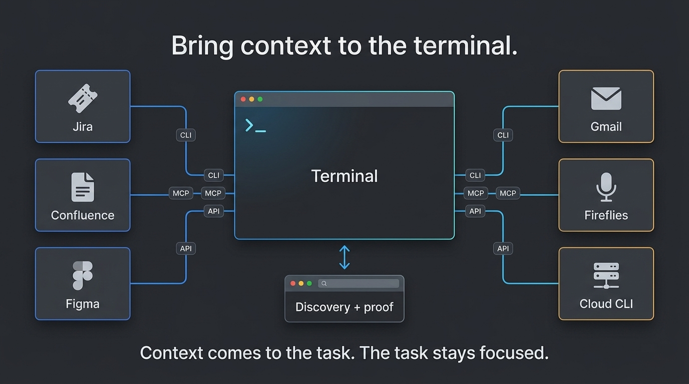

The sources are optional. A task may use Jira, Confluence, Figma, Gmail, Fireflies, cloud CLIs, or none of them. I pull only what the task needs.

I often use [Wispr Flow](https://wisprflow.ai/) to speak the first rough version instead of typing it. That removes friction, but it does not remove the shaping step. The transcript is raw input. I still ask the agent to organize it, challenge unclear parts, and turn it into a goal that can be tested.

Access is handled separately. An access-checking skill tells the agent whether a system is available, which account or project it is using, where the credential authority lives, and how to prove access without printing the secret.

Email is read-only by default and limited by account, search, and date. Meeting transcripts are used only when policy and consent allow it. I keep the decisions and actions, not an endless raw transcript.

When a useful website has no usable CLI or public API, [Apiify](https://github.com/sabirmgd/apiify-skills) uses the browser once for discovery or login, then turns the workflow into the cheapest reliable script. The browser remains the right tool for user-facing proof. It is a poor runtime for repeated data work when a deterministic request is possible.

## Let loops watch the boring parts

Some tasks should keep checking while I do something else: pull request comments, CI, deployments, runtime health, dependency waits, or cleanup.

I run each loop as a small tick. One tick reads the current state, compares it with the last saved state, does only the allowed work, saves its new position, and stops. The next tick starts fresh. This keeps long-running loop sessions from filling up with old diffs and logs.

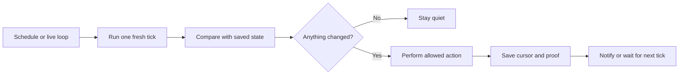

For a live local loop, I leave the laptop awake and keep the Claude Code session running. A typical command looks like:

```text
/loop 30m /loop-tick <project> babysit
```

I use `/schedule` for work that should start at a known time or recur as a routine. A local loop can reach local files, CLIs, and authenticated sessions because it runs on my machine. A cloud-scheduled task can only reach what its cloud environment and connected tools expose. I do not assume the two have the same access.

The useful loop types are described in [the playbooks](docs/playbooks.md): development, review and fix, pull request babysitting, CI and deployment watching, dependency waiting, runtime monitoring, knowledge capture, and cleanup.

Every loop needs saved state, idempotent actions, a quiet path, an authority boundary, and a stop rule. Without those, it is not automation. It is an agent repeatedly making guesses.

## Progress should be tied to proof

I do not want “still working” messages. I want to know what passed, what is next, and whether anything needs me.

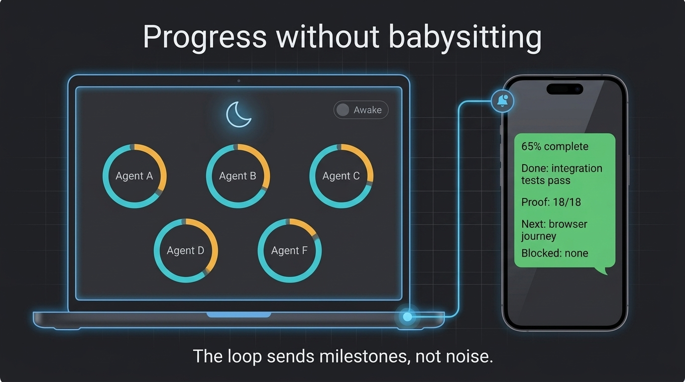

A useful update looks like this:

```text
65% complete
Done: integration tests pass
Proof: 18/18
Next: browser journey
Blocked: none
```

The percentage comes from planned milestones, not elapsed time. For a feature, the milestones may be context, plan, implementation, focused tests, integration proof, review, CI, deployment, and final user journey. A task without deployment removes those steps.

I send important milestones to WhatsApp through a local automation bridge. The loop sends decisions and proof, not raw terminal noise.

## What “done” means

Local green is useful. A pushed branch is useful. A merged pull request and a successful deployment are useful. None of them alone proves the user's outcome.

I call the task done when the intended user or operator can achieve the result, the required tests pass, the exact reviewed version is the version being tested, user-facing work has browser proof, confirmed review findings are closed, and temporary worktrees, slots, sessions, and test data are cleaned up.

That is the whole system:

> Shape the task, define the proof, isolate the work, keep the feedback loop cheap, let the goal run, and return only for a decision or verified result.

## Go deeper

- [Detailed playbooks and Mermaid flows](docs/playbooks.md)
- [Reusable skill patterns and samples](docs/skill-patterns.md)
- [Visual briefs and Gemini generation notes](docs/visuals.md)

## Tools mentioned

[cmux](https://cmux.com/) · [Codex](https://developers.openai.com/codex/) · [Claude Code](https://docs.anthropic.com/en/docs/claude-code/overview) · [Wispr Flow](https://wisprflow.ai/) · [Fireflies](https://fireflies.ai/security) · [agent-browser](https://github.com/vercel-labs/agent-browser) · [Superpowers](https://github.com/obra/superpowers) · [Ponytail](https://github.com/DietrichGebert/ponytail) · [PR Review Toolkit](https://github.com/anthropics/claude-plugins-official/blob/main/plugins/pr-review-toolkit/README.md) · [code-simplifier](https://github.com/anthropics/claude-plugins-official/blob/main/plugins/code-simplifier/agents/code-simplifier.md) · [Taste](https://github.com/leonxlnx/taste-skill) · [Impeccable](https://github.com/pbakaus/impeccable) · [Apiify](https://github.com/sabirmgd/apiify-skills)
