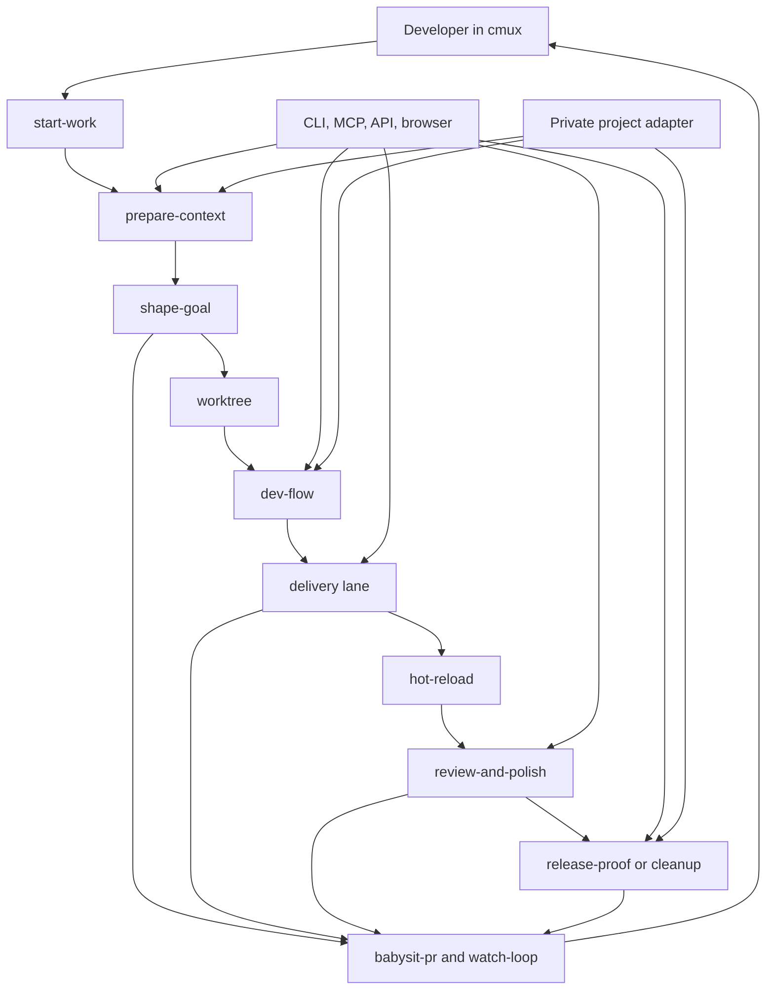

# Architecture

This repository has three layers:

- the article explains the operating model
- the skills make the model reusable
- private adapters supply real repos, accounts, credentials, and release rules

## The core flow

## What the public core owns

The public core defines:

- lane selection
- context discipline
- goal shaping
- worktree isolation
- warm infra and slot discipline
- cheap proof loops
- browser proof
- review and simplification gates
- release truth
- safe cleanup

It does not define real repo names, ticket prefixes, cloud accounts, local paths,
notification targets, credentials, or production commands.

## State model

A durable task usually needs only a small amount of state:

- lane
- current goal
- exact candidate
- accepted proof
- open findings
- wait state
- next action

A loop adds:

- last cursor
- retry count
- idempotency marker
- notification route

## Quality model

The public architecture assumes role separation:

- one maker builds
- one reviewer challenges
- one simplifier removes bloat
- one verifier checks the final candidate

The runtime may implement those roles with one tool, several models, or several
agents. The public core defines the contract, not the brand.
