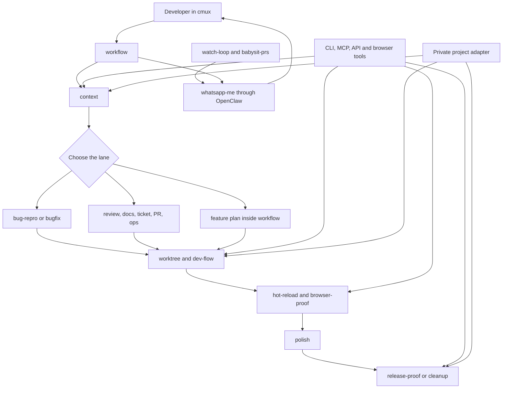

# Coding Operating System Architecture

The framework has three layers:

1. `workflow` is the front door.
2. Concrete skills do one recognizable job.
3. Community tools, native agent features, and private project adapters supply capabilities and real environment details.

This keeps the system simple for the developer without making each skill shallow.

## The main path



## Layer 1: one front door

`workflow` is the only general orchestrator. It reads repository guidance, checks freshness, chooses the lane, calls `context` when outside information matters, defines proof, decides whether a worktree or runtime slot is needed, and routes to the next concrete skill.

The repository does not ship separate front doors for planning, context, goal shaping, feature delivery, and task setup. Those are stages inside `workflow`.

## Layer 2: concrete skills

Concrete skills use names a developer can recognize:

- `context`, `jira-manager`, and `docs-manager` gather or manage information;
- `bug-repro` and `bugfix` handle bug work;
- `worktree`, `dev-flow`, `hot-reload`, and `browser-proof` isolate and prove code;
- `polish`, `pr-manager`, and `release-proof` finish and ship work;
- `watch-loop`, `babysit-prs`, and `whatsapp-me` keep work moving and report milestones;
- `access-check`, `sync-project`, `status-report`, and `cleanup` support the edges.

Each concrete skill is independently useful. `workflow` names the best next skill, but there is no custom loader or dependency graph. If that skill is not installed, the agent can follow the same handoff contract using available tools.

`whatsapp-me` is an immediate delivery capability, not a watcher. `workflow`, `bugfix`, `polish`, `release-proof`, or `babysit-prs` may call it when a real milestone should reach someone away from the terminal.

## Layer 3: capabilities and private adapters

Community and native capabilities stay upstream. Examples include Ponytail, Impeccable, agent-browser, the Claude PR Review Toolkit, Codex subagents, Claude Code loops, and MCP connectors.

Private project adapters supply details that should not appear here:

```text
repository paths
ticket prefixes
accounts and tenants
cloud projects and clusters
credential authorities
test and release commands
notification destinations
company approval rules
```

The public skill defines what must happen. The private adapter tells the agent how that project performs it.

## State

A durable task needs a small record:

```text
lane
goal
exact candidate
accepted proof
open findings
wait state
next action
authority boundary
cleanup ledger
```

A loop adds a cursor, last observed state, retry count, idempotency record, and notification route.

## Authority

Public defaults are conservative:

- read-only inspection and local non-destructive checks can run when relevant;
- in-scope code changes can run when the user asked for implementation;
- external writes, comments, merges, deployments, releases, destructive cleanup, purchases, and scope expansion need explicit authority;
- unattended loops default to read-only or notification-only unless a narrower action was explicitly configured;
- missing proof remains missing, and errors remain visible.

## What this repo does not build

It does not build another scheduler, agent runtime, secret store, deployment platform, or messaging gateway. It uses the ones the developer already has and connects them with consistent workflows.
