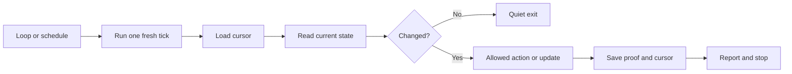

# Loops and Babysitters

Loops are how I avoid watching long-running work manually.

The useful pattern is one fresh tick at a time. Each tick reads saved state,
checks the real source, performs only allowed work, saves its cursor, reports
only meaningful changes, and stops.

## The loop contract

Every loop should define:

- what it watches
- where its cursor lives
- what proof it trusts
- whether it is read-only or allowed one narrow mutation
- what counts as a meaningful change
- when it should stop
- where updates go



## The loops I use most

### PR babysitter

This loop watches one exact branch or PR head for new commits, new review
comments, CI changes, mergeability changes, and stale proof after the head
moves.

### CI or deployment watcher

This loop tracks one run or rollout until it lands in a terminal state and ties
it to one exact candidate.

### Dependency wait

Sometimes the only missing thing is outside the repo: a review reply, a
credential, a workflow finish, or a slot becoming ready. That should become an
explicit wait, not vague status spam.

### Context-prep loop

This loop gathers the ticket, design, doc, email, or transcript before the main
build lane starts. The scope should stay narrow.

### Cleanup loop

This loop checks worktrees, local slots, port forwards, and other disposable
state after a task is done. It should never delete dirty or ambiguous state just
to look clean.

## Local loops and scheduled jobs

Use a local loop when the task depends on local state such as the current
checkout, local files, local CLIs, or local browser sessions. This is why
leaving the laptop awake matters.

Use a scheduled job when timing matters more than the current live terminal. The
key question is always the same: what environment is running the task, and what
can it actually access?

## OpenClaw and WhatsApp

I use OpenClaw as the transport for milestone updates, babysitter reports,
proof receipts, decision requests, and handoffs. That often lands on WhatsApp.

The message should be short and proof-based:

```text
PROGRESS UPDATE | task=review branch 47 | percent=65
DONE | integration tests pass
PROOF | 18/18
NEXT | browser journey
BLOCKED | none
```

The loop should send milestones, not raw terminal output.
