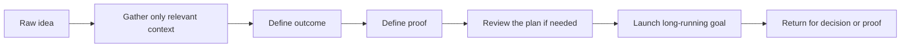
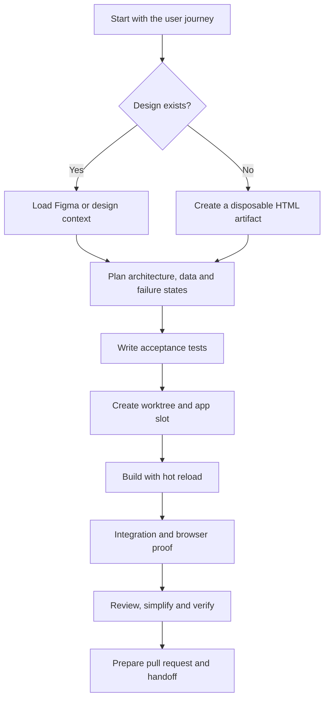
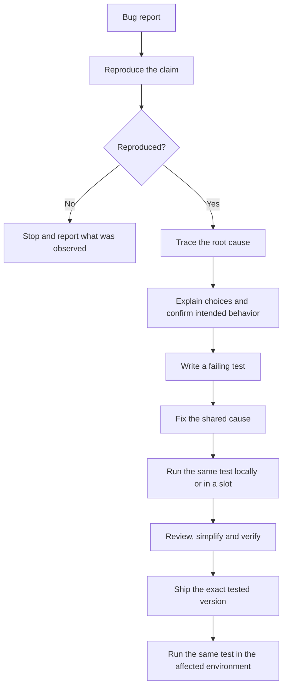
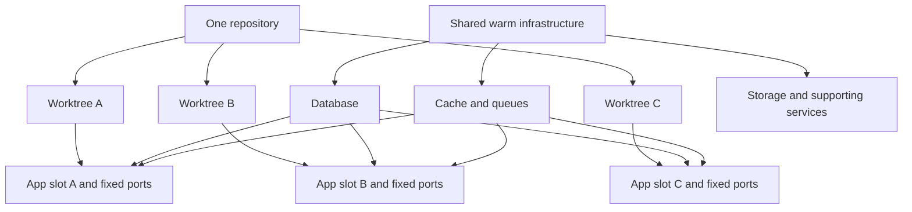
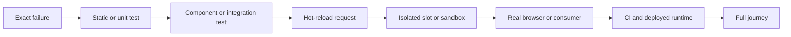
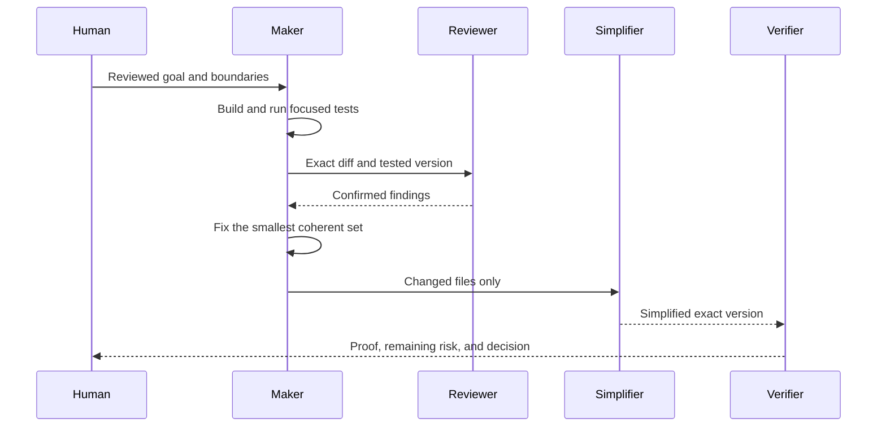
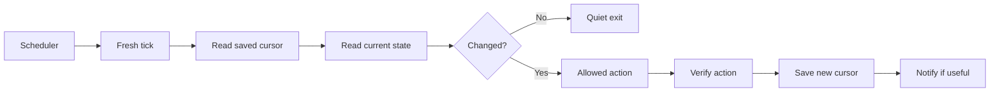

# Playbooks

The main article explains the ideas. This file turns them into reusable flows.

## 1. Shape and launch a task

Spend a short, focused session defining the task before asking an agent to run for hours.

```text
Outcome: What changes for the user or operator?
Context: Which code, tickets, designs, documents, or messages matter?
Proof: What will fail before the work and pass afterward?
Decisions: Which choices still need a human?
Stop: What must make the agent pause?
```



## 2. Feature delivery



The final proof depends on the surface. Backend behavior normally needs a real API or integration test. User-facing behavior needs the actual browser journey and screenshots.

## 3. Bug fixing



Investigation can run without a human when it is read-only. Fixing pauses only when the expected behavior or risk choice is genuinely unclear.

## 4. Worktrees, warm infrastructure, and slots



A slot should support five operations: start, list, smoke, stop, and release. Stopping an app slot must not stop shared infrastructure.

## 5. Cheapest-test loop



Do not climb while the current level is red. When a higher level exposes a new error, return to the cheapest level that reproduces that error. Keep unrelated passing proof.

## 6. Maker, reviewer, simplifier, verifier



The reviewer may discover issues. A verifier can confirm or reject those issues against the code. Verification should not become a new, unbounded review.

## 7. Running loops

Every recurring loop is a sequence of small, fresh ticks.



### Live local loop

Use a live loop when the task needs local files, local CLIs, signed-in sessions, or the current checkout.

```text
/loop 30m /loop-tick <project> babysit
```

The laptop must stay awake, the network must remain available, and the Claude Code session must keep running.

### Scheduled routine

Use `/schedule` when a task should start at a known time or recur without manually opening the same prompt. Confirm what environment the routine runs in. A cloud routine does not automatically inherit access to local files, keychains, CLIs, browser sessions, or worktrees.

### Useful loop types

| Loop | One tick | Stop condition |
| --- | --- | --- |
| Development | Run the smallest failing test and next safe fix | Candidate is ready or a decision is needed |
| Review and fix | Review the latest diff and recheck confirmed findings | Clean, no progress, or round limit |
| Pull request babysitter | Check new commits, comments, CI, and merge state | Closed, merged, or human decision |
| CI and deployment watcher | Poll one run tied to one commit | Success, failure, cancellation, timeout, or new commit |
| Dependency wait | Check one named outside condition | Condition changes or wait is cancelled |
| Runtime monitor | Compare health with the last snapshot | Meaningful change or scheduled digest |
| Knowledge capture | Turn one approved source into a short durable note | Note saved or external publication needs approval |
| Cleanup | Recheck and remove safe disposable resources | Everything removed or ambiguous state found |

Every loop needs saved state, idempotent actions, a quiet path, an authority limit, and a maximum retry or review count.

## 8. Progress updates

Define milestones before starting. The percentage is the weight of completed milestones, not a guess based on time.

```text
65% complete
Done: integration tests pass
Proof: 18/18
Next: browser journey
Blocked: none
```

Never report 100% while required runtime proof, cleanup, or a human decision remains open.
