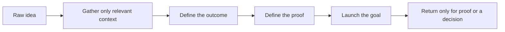
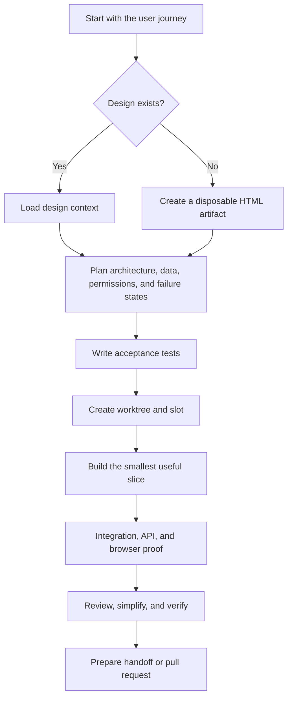
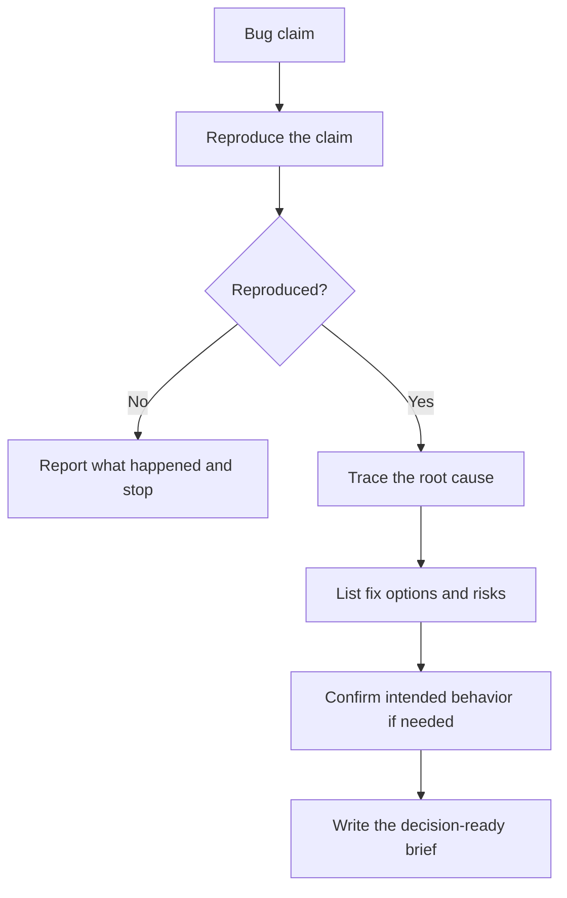
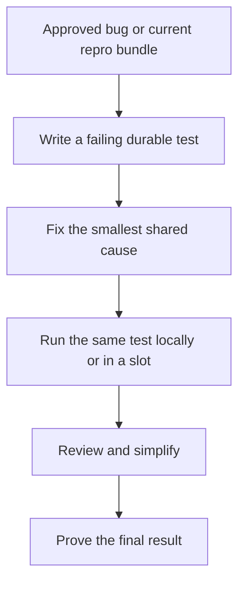
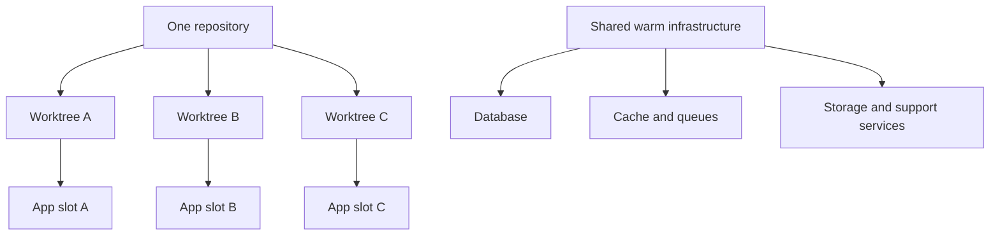
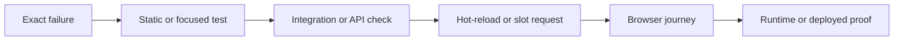
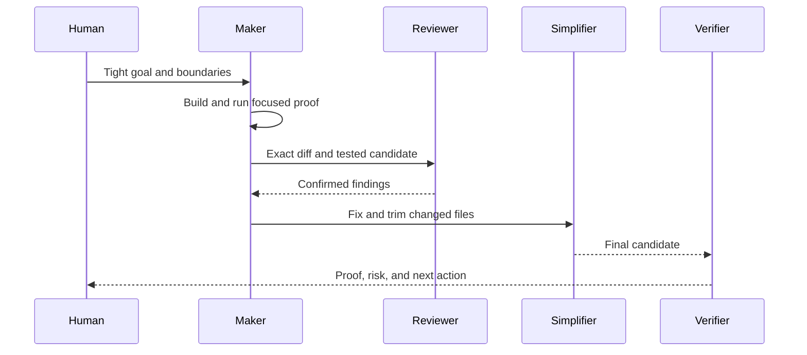
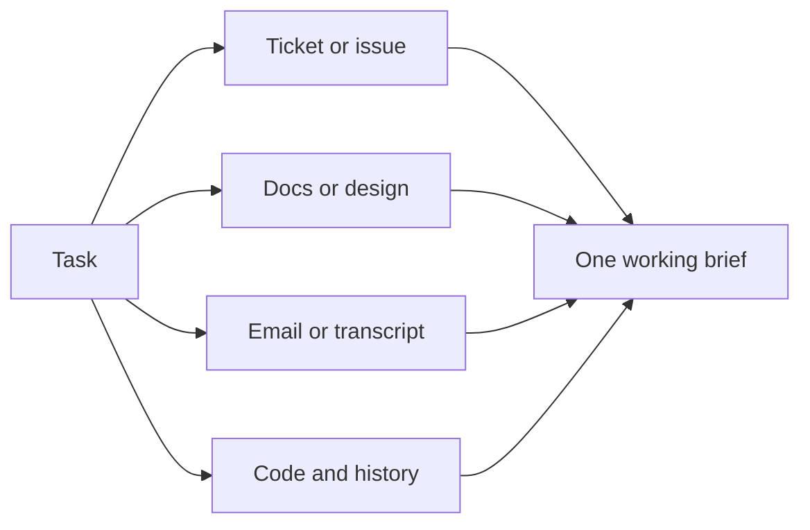
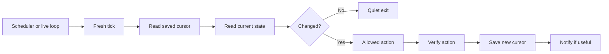
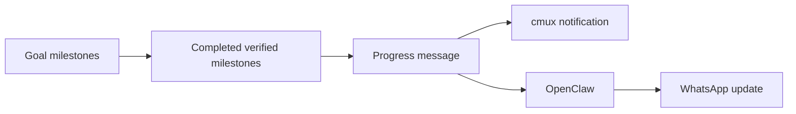

# Playbooks

The article explains the ideas. This file turns them into repeatable flows.

## 1. Shape and launch a task

Spend a short focused session defining the task before asking an agent to run for hours.

```text
Outcome: What changes for the user or operator?
Context: Which code, tickets, docs, emails, or designs matter?
Proof: What should fail before the work and pass afterward?
Decisions: Which choices still need a human?
Stop: What should make the agent pause?
```



## 2. Feature delivery



Notes:

- Start from the user journey, not only the backend shape.
- If the UI is unclear, create something disposable that lets you see it.
- The proof should live in the repository when possible.

## 3. Bug investigation



Investigation is a real lane. It is not just the first paragraph of a bug fix.

## 4. Bug fixing



Notes:

- Reproducing the bug is not enough. The fix needs a durable test.
- The smallest fix should live at the shared cause when possible.
- Local green is not shipped proof when the environment matters.

## 5. Worktrees, warm infrastructure, and slots



The operating rules are simple:

- shared infrastructure stays warm
- each mutable task gets its own slot
- stopping a slot must not stop shared services
- cleanup should release slot state, browser state, worktree state, and disposable test data

## 6. Cheapest useful test ladder



Rules:

- do not jump to the most expensive proof first
- do not rerun the full stack after every tiny edit
- if a higher level fails, drop back to the cheapest level that reproduces that failure

## 7. Maker, reviewer, simplifier, verifier



## 8. Context capture



Pull only what the task needs from systems like Jira, Confluence, Figma, Gmail, meeting transcripts, code, and git history.

## 9. Loops

Every loop should run in small fresh ticks.



### Useful loop types

| Loop | One tick does | Typical stop condition |
| --- | --- | --- |
| Pull request babysitter | Check new commits, comments, CI, review state, and mergeability | Closed, merged, or human decision |
| CI or deploy watcher | Poll one run tied to one candidate | Success, failure, timeout, or new candidate |
| Bug investigation loop | Keep narrowing a repro or root cause inside approved boundaries | Root-cause brief or human decision |
| Context prefetch loop | Pull new ticket, doc, or transcript context for tomorrow's work | Brief captured or source unchanged |
| Dependency wait | Check one named outside condition | Condition changed or wait cancelled |
| Cleanup loop | Remove safe disposable resources | Everything cleaned or ambiguity found |

### Local loops and scheduled loops

Local loops are useful when the work depends on local files, local CLIs, a signed-in browser session, or the current worktree. That is where leaving the laptop open and letting a live agent session keep running makes sense.

Scheduled loops are useful when the task should start at a known time or recur predictably. A cloud schedule does not automatically inherit local files, keychains, CLI auth, or browser sessions.

## 10. Proof-based progress

The percentage should reflect completed milestones, not elapsed time.



Useful format:

```text
65% complete
Done: integration tests pass
Proof: 18/18
Next: browser journey
Blocked: none
```
