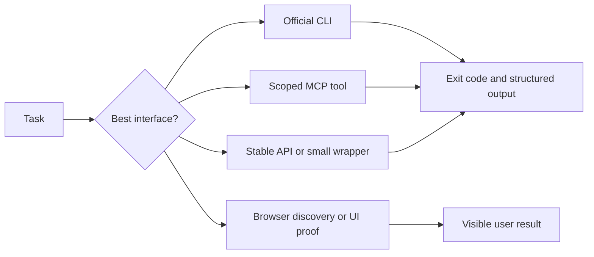

# CLI, MCP, API, and Browser Tooling

The rule is simple: use the cheapest reliable interface for the task, and use the browser when the thing being proved is visible behavior.



## CLIs

These are common tools in this operating model. A project only needs the ones that match its stack.

| Area | CLI | What it gives the agent |
| --- | --- | --- |
| Source control | `git` | Worktrees, branches, exact diffs, history, commits, candidate identity |
| GitHub | `gh` | Pull requests, checks, workflows, releases, repository state |
| GitLab | `glab` or API-backed `curl` | Merge requests, pipelines, discussions, approvals |
| Project cockpit | `cmux` | Workspaces, tabs, panes, notifications, programmable session access |
| Coding agents | `codex`, `claude` | Makers, reviewers, planners, verifiers, skills, and long-running sessions |
| Agent orchestration | `omx` | Roles, teams, state, review workflows, and local orchestration |
| Containers | `docker`, `docker compose` | Warm shared infrastructure and isolated app slots |
| Kubernetes | `kubectl`, `helm` | Runtime state, rendered config, rollouts, logs, deployed images |
| Cloud | `gcloud`, `doctl`, `wrangler`, `az`, `aws` | Explicit project, cluster, DNS, storage, and deployment operations |
| Browser proof | `agent-browser` | Real journeys, screenshots, console and network evidence |
| HTTP and data | `curl`, `jq`, `yq` | API probes and structured JSON or YAML inspection |
| Testing | project-native test commands | Unit, integration, contract, end-to-end, lint, type, and build proof |

An installed CLI is not proof that it is authenticated for the right organization. Operational commands should name the intended account, project, repository, region, tenant, or cluster when the tool supports it.

## MCPs

MCP is useful when it exposes a clean application action without forcing the agent to repeat UI steps.

| Capability | Typical MCP | Good use |
| --- | --- | --- |
| Source collaboration | GitHub or GitLab | Read PRs, comments, discussions, checks, and approved review actions |
| Tickets | Jira or another issue tracker | Retrieve tickets, draft or perform approved updates, link evidence |
| Documentation | Confluence, Notion, Google Docs | Read decisions, draft pages, publish with authority |
| Design | Figma | Read frames, variables, screenshots, and design context |
| Email and files | Gmail, Drive | Fetch narrow task context and approved attachments |
| Meetings | Calendar, Fireflies | Retrieve approved call context, decisions, and actions |
| Communication | Slack, Teams, configured chat tools | Read scoped threads or deliver approved handoffs |
| Browser/computer | Browser or computer-use MCP | Inspect user-visible state when that is the chosen browser surface |
| Documentation lookup | SDK and framework reference MCPs | Fetch current official technical documentation |
| Agent state | Memory, goal, state, and trace MCPs | Persist proof, cursors, wait states, and execution traces |

An MCP name is not proof that access works. `access-check` verifies identity, target, scope, and one safe operation before another skill depends on it.

## How `context` uses smaller capabilities

The `context` skill is the umbrella. It calls concrete skills or configured tools only when the source matters:

```text
context
  -> jira-manager for tickets
  -> docs-manager for Confluence or wiki pages
  -> Figma MCP for design
  -> Gmail connector for narrow email context
  -> Fireflies connector for approved call transcripts
  -> git and runtime tools for current behavior
```

This keeps the user-facing workflow simple while preserving the smaller tools underneath it.

## APIify

When a useful system has no usable CLI or public API, [Apiify](https://github.com/sabirmgd/apiify-skills) pays the browser cost once during discovery, then tries to move repeated work down this ladder:

```text
public API
private XHR or GraphQL request
authenticated in-browser request
DOM automation as the last resort
```

The result should be a deterministic script with explicit inputs, structured output, safe authentication, real verification, and documented drift risk. It must not bypass access controls, paywalls, CAPTCHAs, policy, or site terms.

## Private tool profile

Real project values stay in private guidance:

```yaml
tool: example-cloud
purpose: inspect deployment state
interface: cli
identity: operator-account
target: explicit-project
authority: local-secret-store
mode: read-only
proof: list one allowed resource
mutation_requires: explicit approval
```

The public skill owns the workflow. The private profile owns real accounts, paths, projects, tenants, clusters, and secret authorities.

## Failure rules

- Do not switch organizations, accounts, providers, or clusters silently.
- Do not print tokens, cookies, passwords, private keys, kubeconfig contents, or secret values.
- Do not treat a public page as proof of admin access.
- Do not replace failed UI proof with an API check and call the UI verified.
- Do not keep browser sessions, port forwards, or temporary credentials open after proof.
- Do not turn a read-only context request into a write.
