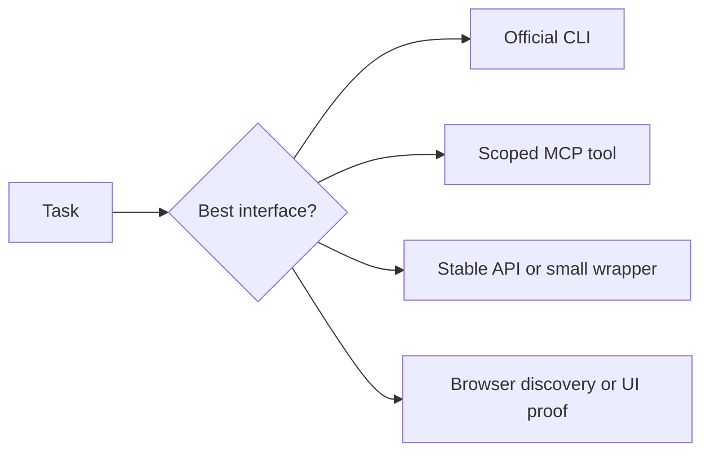

# Tooling Ladder

The operating system keeps one simple rule:

Use the cheapest reliable interface for the task, and use the browser when the
thing being proved is visible behavior.

## The ladder

## How I choose

### CLI first

I prefer a CLI when:

- the operation is repeatable
- the output is structured enough to verify
- the task lives comfortably in the terminal

Examples include `git`, source-control CLIs, `docker`, `kubectl`, `helm`, cloud
CLIs, and small tools like `curl`, `jq`, and `yq`.

CLIs matter because they remove friction for the agent.

### MCP when the connector is better than the UI

I use MCP when the tool exposes a clean, scoped action such as Jira,
Confluence, Figma, Gmail, docs, files, calendars, or source collaboration.

### API or wrapper when the work repeats

If the task keeps happening and the system has no good CLI, I want a scriptable
surface. That is where wrappers such as [Apiify](https://github.com/sabirmgd/apiify-skills) fit.

### Browser for proof

The browser is still the right tool when the claim is about what a user sees or
does. For that I prefer [agent-browser](https://github.com/vercel-labs/agent-browser)
or another browser tool that can save proof.

## Common context sources

The exact list changes by task, but the common categories are:

- issue trackers such as Jira
- docs such as Confluence
- design tools such as Figma
- Gmail for narrow email context
- meeting transcripts such as Fireflies, when policy allows
- cloud platforms and runtime CLIs
- local repos, tests, and scripts

## Hard rules

1. Do not switch organizations, accounts, or clusters silently.
2. Do not print tokens, cookies, passwords, or secret values.
3. Do not replace browser proof with an API check and call the UI verified.
4. Do not use the browser for repeated data work when a deterministic request is available.
5. Do not turn a read-only context request into a write.
